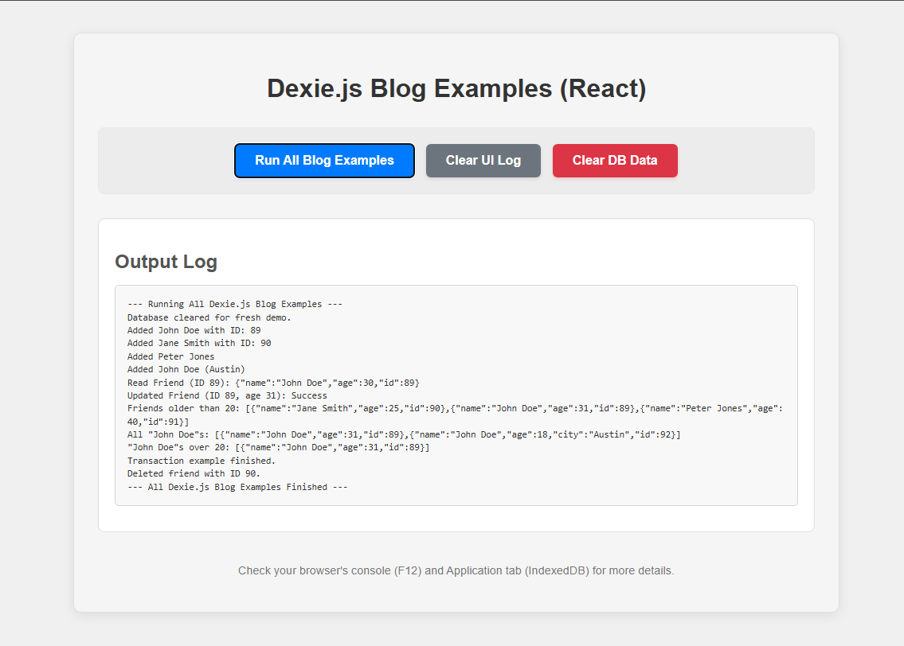

# Dexie.js React Demo

This repository demonstrates advanced CRUD (Create, Read, Update, Delete) operations and other powerful features using **Dexie.js** with React and TypeScript. It's designed to be a comprehensive example for developers looking to efficiently manage client-side data persistence with IndexedDB in a modern web application.

## Features

This project showcases how to leverage Dexie.js to interact with IndexedDB in a streamlined manner. Key features and concepts demonstrated include:

* **Comprehensive CRUD Operations:**
    * **C**reate: Adding new friend records.
    * **R**ead: Retrieving friends by ID, or fetching multiple friends based on various criteria.
    * **U**pdate: Modifying existing friend records.
    * **D**elete: Removing friends from the database.
* **Advanced Querying:** Execute complex queries like filtering by age, name, and combined conditions (e.g., "John Doe" older than 20).
* **Transactions:** Perform atomic operations, ensuring data integrity by grouping multiple database actions that either all succeed or all fail together.
* **Database Versioning & Migration:** Demonstrates how to gracefully update the database schema (e.g., adding a new `city` field) in a new version.
* **React and TypeScript:** Built using React for a dynamic UI and TypeScript for robust type safety and improved code quality.
* **Asynchronous Handling:** Clear demonstration of how to manage the asynchronous nature of IndexedDB operations with `async/await`.
* **Robust Error Handling:** Provides basic error display and console logging for database operation failures.
* **Database Readiness:** Correctly handles the database opening and closing, ensuring operations are performed only when the database is ready.
* **Interactive UI Log:** A dedicated section in the frontend to log the results and status of database operations, providing immediate feedback.
* **Modern Dev Setup:** Utilizes Vite for a fast and efficient development experience.

## Technologies Used

* **[React](https://react.dev/)**: A JavaScript library for building user interfaces.
* **[Dexie.js](https://dexie.org/)**: A powerful and user-friendly wrapper for IndexedDB, simplifying complex client-side database management.
* **[TypeScript](https://www.typescriptlang.org/)**: Enhances JavaScript with static type definitions, leading to more maintainable and less error-prone code.
* **[Vite](https://vitejs.dev/)**: A next-generation frontend tooling that provides an extremely fast development server and optimized build processes.

## Screenshots



---

## Getting Started

Follow these steps to set up and run the project locally.

### Prerequisites

* Node.js and npm (Node Package Manager) installed on your machine.

### Installation

1.  **Clone the repository:**
    ```bash
    git clone https://github.com/hxrshll/Dexie.js
    cd Dexie.js
    ```

2.  **Install the dependencies:**
    ```bash
    npm install
    # or
    yarn install
    ```

### Running the Development Server


To start the application in development mode:

```bash
npm run dev
# or
yarn dev
````

This will typically launch the application at `http://localhost:5173/` (Vite's default port). Open this URL in your web browser.

### Important Note for Fresh Starts / Troubleshooting:

If you encounter issues (e.g., caching problems, dependency conflicts, or unexpected IndexedDB behavior), performing a clean reset often resolves them:

1. **Stop your development server** (Ctrl+C in the terminal).
2. **Delete `node_modules` and lock files:**

   ```bash
   rm -rf node_modules package-lock.json yarn.lock .vite
   ```
3. **Clear npm cache:**

   ```bash
   npm cache clean --force
   ```
4. **Reinstall dependencies:**

   ```bash
   npm install
   ```
5. **Clear browser site data:** Open your browser's Developer Tools (F12), go to the "Application" tab, and clear "IndexedDB" and "Cache Storage" for `localhost`. Close and reopen your browser tab.
6. **Restart the development server:** `npm run dev`

---

## Usage

The application provides an intuitive UI to interact with the Dexie.js-managed IndexedDB database.

1. **"Run All Blog Examples"**: This is the primary button to click. It executes a predefined sequence of database operations, including adding new friends, updating some, performing various queries (by age, by name, combined), executing a transaction with multiple additions, and deleting a friend.
2. **"Clear UI Log"**: Resets the messages displayed in the "Output Log" section.
3. **"Clear DB Data"**: Empties the `friends` table within your IndexedDB. Use this to start with a completely fresh database state for testing or demonstration.

All operations and their results are logged in the "Output Log" on the UI. For more detailed information, consult your browser's developer console (F12) for logs and the "Application" tab -> "IndexedDB" to inspect the actual database contents.

---

## Code Structure

* `public/index.html`: The main HTML entry point, including a global `body` style for the background.
* `src/main.tsx`: The main entry file for the React application, rendering the `App` component.
* `src/App.tsx`: The core React component that handles the UI layout, user interactions, state management, and orchestrates the database operations via functions from `db.ts`.
* `src/db.ts`: Contains the entire Dexie.js database setup. This file defines the `MyDatabase` class, the `Friend` interface, database versioning, schema definition, and all the asynchronous helper functions for CRUD operations, complex queries, and transactions.
* `src/index.css`: A minimal CSS file (most styling is handled inline within `App.tsx` for simplicity in this demo).

---

## Understanding Dexie.js & IndexedDB

This project serves as a practical guide to using Dexie.js. Dexie.js is a robust, performant, and delightful wrapper for IndexedDB, a powerful, asynchronous, transactional, object-oriented database that runs entirely in the browser. It allows you to store significant amounts of structured data client-side, making your web applications more capable offline or with reduced server reliance.

### Key Concepts Demonstrated by Dexie.js:

* **Declarative Schema:** Define your database tables and their indexes in a clear, declarative way.
* **Promise-based API:** All operations return Promises, making `async/await` usage clean and straightforward.
* **Powerful Queries:** Easily construct complex queries using method chaining (e.g., `.where().above().and()`).
* **Transactions:** Dexie.js simplifies IndexedDB's transaction model, ensuring atomicity for multiple operations.
* **Schema Migration:** Gracefully handle database upgrades and structural changes without losing user data.

---

## License

This project is [MIT licensed](https://www.google.com/search?q=LICENSE).

## Author

**Harshal**

* GitHub: [@hxrshll](https://github.com/hxrshll)

## Acknowledgments

* [React](https://react.dev/)
* [Dexie.js](https://dexie.org/)
* [TypeScript](https://www.typescriptlang.org/)
* [Vite](https://vitejs.dev/)
* The IndexedDB API documentation
